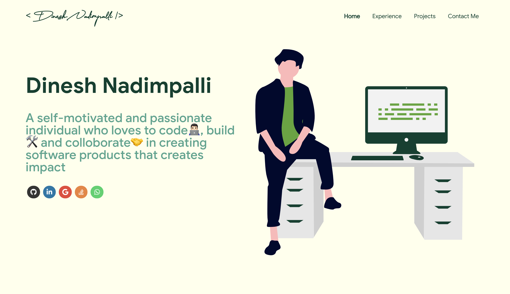

# 🚀A simple and easy to build <i><b>Custom Portfolio</b></i> 👨🏻‍💻 inspired by Masterportfolio 

  

## Steps to run

- <code>npm install</code> in the root directory
- <code>npm start</code> which will run the app on http://localhost:3000

## Key Points

Consists of all the features the original repo has with some custom made views based on my requirements

## Additional features

- 🌈Theme change on every page refresh (Note: new themes can be added in <code>theme.js</code>)

-  👨🏻‍🎨Custom stepper view in <b>Experience</b> section with company logo and short description

- Tooltips on all the Icons

More feature list can be found in the original repo

> Github link for Masterportfolio https://github.com/ashutosh1919/masterPortfolio
